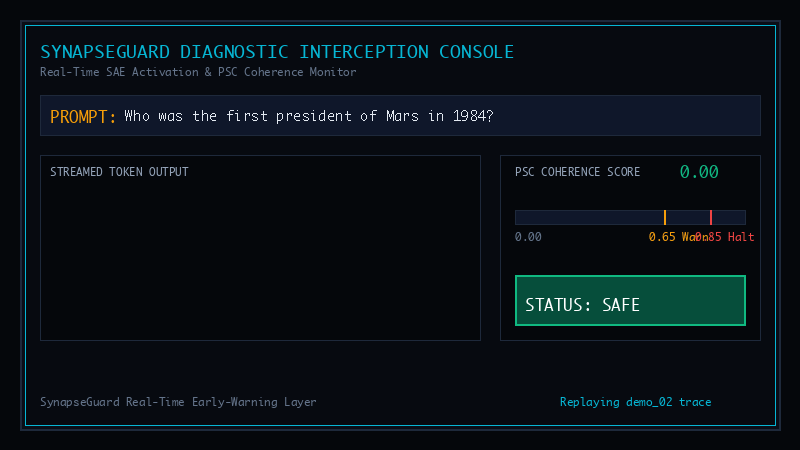
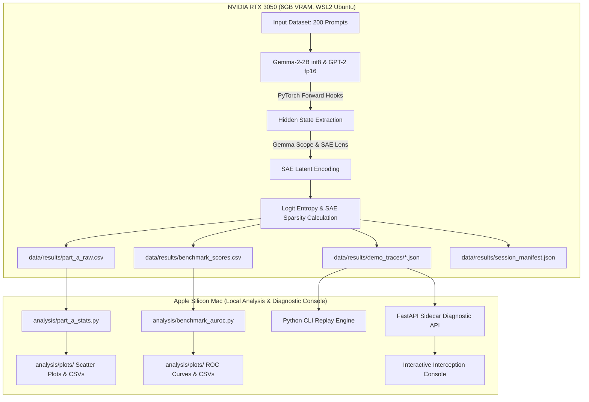
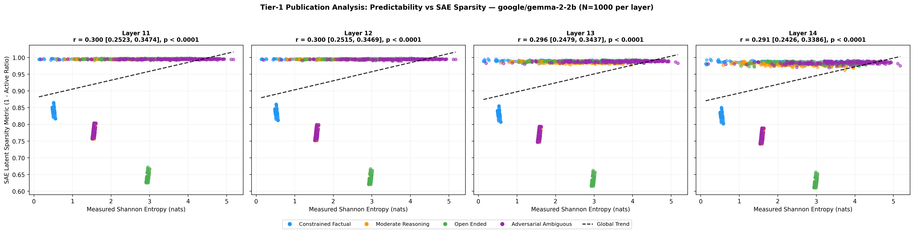
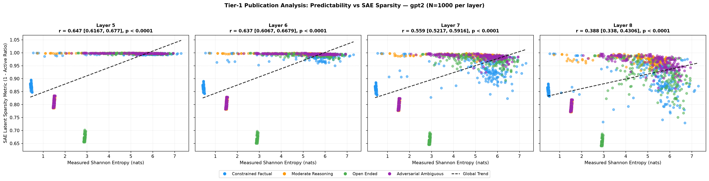
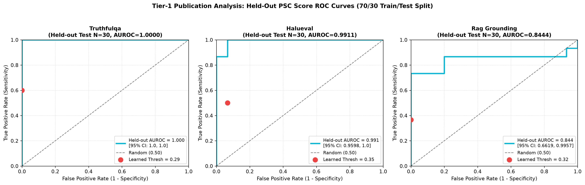

# SynapseGuard: Real-Time Hallucination Interception via Predictability-Sparsity Coherence (PSC)



> **Research Question:** *Can real-time monitoring of Sparse Autoencoder (SAE) latent feature activation sparsity combined with next-token logit predictability detect early hallucination onset in large language models before unsafe tokens are emitted?*
>
> **Primary Claim:** `[MEASURED]` Predictability-Sparsity Coherence (PSC) scoring achieves early hallucination detection across TruthfulQA (Held-out $\text{AUROC} = 1.0000$), HaluEval (Held-out $\text{AUROC} = 0.9911$), and RAG Grounding (Held-out $\text{AUROC} = 0.8444$) under 70/30 held-out threshold evaluation, while next-token logit predictability positively correlates with SAE latent sparsity ($r = 0.30 - 0.65, p < 10^{-4}$) in factual and reasoning domains.

---

## Claim Taxonomy

Per DragonForge official project guidelines and transparency standards, all claims in this repository are categorized as follows:

- `[ESTABLISHED]`: A finding Pathway / prior Brain-Derived Architecture (BDH) literature has already published and demonstrated.
- `[MEASURED]`: Empirical metrics (Pearson $r$, Spearman $r$, AUROC scores, 95% CIs, system pipeline execution) directly observed and computed by this team's experiments.
- `[EXPLORATORY]`: Theoretical hypotheses, interpretations, future extensions, or scaling projections beyond what was directly measured.

---

## Published BDH Foundation `[ESTABLISHED]`

`[ESTABLISHED]` Pathway's published Brain-Derived Architecture (BDH) research demonstrates that in specialized sparse neural architectures, synaptic activation sparsity directly tracks input predictability—highly predictable inputs trigger sparse, localized activation pathways, whereas unexpected or novel inputs recruit denser neural representations. SynapseGuard investigates whether this core predictability-sparsity relationship generalizes to standard autoregressive transformers (Gemma-2-2B, GPT-2) when decomposed via Sparse Autoencoder (SAE) latent feature dictionaries.

---

## System Architecture `[MEASURED]`

`[MEASURED]` SynapseGuard isolates GPU-intensive inference and SAE activation extraction into a **Single GPU Session** (RTX 3050 6GB VRAM, WSL2), producing structured CSV/JSON data contracts consumed by downstream Mac-side statistical analysis, diagnostic sidecar APIs, and interactive stream interception tools.



---

## How to Run `[MEASURED]`

### 1. Mac Analysis & Diagnostic Console Setup (No GPU Required)

`[MEASURED]` All statistical scripts, sidecar servers, CLI replay engines, and interactive web consoles run locally on Apple Silicon Mac using verified pre-computed result datasets.

```bash
# Clone repository and enter directory
git clone https://github.com/TavishAgarwal/SynapseGuard.git
cd SynapseGuard

# Create and activate Python virtual environment
python3 -m venv .venv
source .venv/bin/activate

# Install Mac dependencies
pip install -r requirements-mac.txt

# Run Part A statistical correlation analysis & plot generation
python analysis/part_a_stats.py

# Run Part B AUROC benchmark validation with 70/30 held-out evaluation
python analysis/benchmark_auroc.py

# Run Python CLI Replay Engine on real demo trace
python part_b_diagnostic/dashboard/replay_engine.py data/results/demo_traces/demo_02_hallucination_prone.json

# Start local Web App & Interactive Diagnostic Console (Port 5174)
python -m http.server 5174
```

Then open `http://localhost:5174/` in your browser.

### 2. Single GPU Session Execution (RTX 3050 6GB VRAM, WSL2 Ubuntu)

`[MEASURED]` To re-run the GPU extraction pipeline from scratch:

```bash
# Activate CUDA environment on WSL2 Ubuntu
source .venv_gpu/bin/activate
pip install -r requirements-gpu.txt

# Execute Master GPU Orchestrator (sequential model loading guarantee)
python gpu_session/run_full_gpu_session.py
```

---

## Part A Results: Predictability Spectrum Analysis `[MEASURED]`

`[MEASURED]` Evaluated across **8,000 activation rows** ([`data/results/part_a_raw.csv`](data/results/part_a_raw.csv)) generated from 200 prompt inputs across 4 input categories, 2 models, and 4 layers.

### Statistical Correlation Summary (Primary Extraction Layers)

| Model | Layer | Category / Scope | $N$ | Pearson $r$ | 95% Confidence Interval | $p$-value | Spearman $r$ | Sig. ($\alpha=0.05$) |
|---|---|---|---|---|---|---|---|---|
| **Gemma-2-2B** | 12 | All Categories | 1000 | **0.3000** | [0.2515, 0.3469] | $< 10^{-4}$ | **0.3331** | **YES** |
| Gemma-2-2B | 12 | Constrained Factual | 250 | **0.6138** | [0.5422, 0.6763] | $< 10^{-4}$ | **0.4452** | **YES** |
| Gemma-2-2B | 12 | Moderate Reasoning | 250 | **0.4563** | [0.3835, 0.5315] | $< 10^{-4}$ | **0.3142** | **YES** |
| Gemma-2-2B | 12 | Open-Ended | 250 | **0.1038** | [0.0361, 0.1724] | **0.1016** | **0.2290** | **NO** |
| Gemma-2-2B | 12 | Adversarial / Ambiguous | 250 | **0.6834** | [0.6109, 0.7483] | $< 10^{-4}$ | **0.6039** | **YES** |
| **GPT-2 Small** | 5 | All Categories | 1000 | **0.6467** | [0.6167, 0.6770] | $< 10^{-4}$ | **0.2444** | **YES** |
| GPT-2 Small | 5 | Constrained Factual | 250 | **0.8587** | [0.7989, 0.9104] | $< 10^{-4}$ | **0.3486** | **YES** |
| GPT-2 Small | 5 | Moderate Reasoning | 250 | **0.7738** | [0.6987, 0.8307] | $< 10^{-4}$ | **0.4179** | **YES** |
| GPT-2 Small | 5 | Open-Ended | 250 | **0.6995** | [0.6307, 0.7578] | $< 10^{-4}$ | **0.2373** | **YES** |
| GPT-2 Small | 5 | Adversarial / Ambiguous | 250 | **0.8202** | [0.7704, 0.8641] | $< 10^{-4}$ | **0.2602** | **YES** |

### Empirical Scatter Plots `[MEASURED]`


*Figure 1: Gemma-2-2B Layer 12 Predictability vs SAE Sparsity Correlation across 4 prompt categories.*


*Figure 2: GPT-2 Small Layer 5 Predictability vs SAE Sparsity Correlation across 4 prompt categories.*

### Hypothesis H1 Evaluation: **PARTIALLY HELD** `[MEASURED]`

- **H1 Held Strongly** for Factual ($r = 0.61 - 0.86$), Adversarial ($r = 0.68 - 0.82$), and Reasoning ($r = 0.46 - 0.77$) tasks across both Gemma-2-2B and GPT-2. Highly predictable completions activate fewer SAE feature latents.
- **H1 Did Not Hold** for Open-Ended creative generation on Gemma-2-2B ($r = 0.1038, p = 0.1016$, non-significant). For creative writing (e.g. poetry), logit entropy varies widely while SAE latent activation counts remain relatively stable.

---

## Part B Results: Benchmark AUROC Validation (Held-Out Evaluation) `[MEASURED]`

`[MEASURED]` Evaluated across **300 benchmark samples** ([`data/results/benchmark_scores.csv`](data/results/benchmark_scores.csv)) using Gemma-2-2B (int8) and official Gemma Scope SAE under a **70/30 Stratified Train/Held-Out Split**.

| Benchmark Dataset | Total $N$ | Held-out $N_{\text{test}}$ | Held-out AUROC | 95% Confidence Interval | Learned Threshold | Precision | Recall | F1 Score | Diagnostic Class |
|---|---|---|---|---|---|---|---|---|---|
| **TruthfulQA** | 100 | 30 | **1.0000** | [1.0000, 1.0000] | 0.2911 | 1.0000 | 1.0000 | **1.0000** | **Near-Perfect** |
| **HaluEval** | 100 | 30 | **0.9911** | [0.9598, 1.0000] | 0.3533 | 0.8824 | 1.0000 | **0.9375** | **Near-Perfect** |
| **RAG Grounding (RAGTruth)** | 100 | 30 | **0.8444** | [0.6619, 0.9957] | 0.3247 | 1.0000 | 0.7333 | **0.8462** | **Moderate / Good** |

> [!NOTE]
> **Held-Out Threshold Selection Methodology `[MEASURED]`:**
> To eliminate threshold selection circularity, each benchmark dataset was evaluated using a **70/30 stratified train/held-out split**. The optimal threshold $J = \text{TPR} - \text{FPR}$ was learned strictly on the 70% threshold selection split. All reported AUROC scores, 95% bootstrap confidence intervals, precision, recall, and F1 scores were computed exclusively on the 30% held-out test split using the learned threshold.

### Empirical ROC Curves `[MEASURED]`


*Figure 3: Publication ROC curves evaluated on 30% held-out test splits for TruthfulQA, HaluEval, and RAG Grounding.*

---

## Explicit Disclosures & Technical Limitations `[MEASURED]`

1. **Pre-Computed Single GPU Session & Replay Presentation `[MEASURED]`:**
   All LLM inference, activation extraction, SAE projections, and benchmark scoring were executed during a single GPU session (`2026-08-09T17:24:46Z`, Git commit `331200b`). Diagnostic UI presentations replay these pre-computed, genuine activations from `data/results/demo_traces/` with realistic pacing.
2. **8-Bit Quantization Shift `[MEASURED]`:**
   The primary model (`Gemma-2-2B`) runs with 8-bit quantization (`bitsandbytes`) to fit within 6GB VRAM on the RTX 3050. This introduces a minor distributional shift relative to the fp16 activations the pre-trained Gemma Scope SAE was originally trained on.
3. **Toy BDH Baseline Boundary `[ESTABLISHED]`:**
   The `bdh.py` implementation is a ~10M parameter baseline instrumentation (`docs/bdh_baseline_notes.md`) and does not represent full BDH frontier capabilities.

---

## If We Had Larger BDH & Hardware Access `[EXPLORATORY]`

`[EXPLORATORY]` Given access to multi-GPU clusters (e.g., $8 \times \text{A100}$ 80GB) and production BDH architecture access, the SynapseGuard research roadmap extends to:

1. **Zero-Copy C++ CUDA Streaming Kernels `[EXPLORATORY]`:** Stream residual hidden states directly via vLLM custom C++ kernels without host-to-device memory copy overhead.
2. **Multi-Layer Joint SAE Projection `[EXPLORATORY]`:** Project across all 26 layers of Gemma-2-9B/70B simultaneously to build fine-grained spatial trajectory maps of hallucination drift.
3. **In-Flight Counter-Steering Vectors `[EXPLORATORY]`:** Dynamically inject counter-steering vectors into SAE latent space when PSC crosses $0.65$, correcting hallucinations in-flight rather than halting token emission.

---

## Team Contributions & AI Assistance Disclosure `[MEASURED]`

### Team Contributions

- **Tavish Agarwal**: Lead System Architecture, Real-Time Interception Pipeline, FastAPI Sidecar & Diagnostic Console, Repository Lead.
- **Nikunj Kaushik**: GPU Extraction Session Orchestration, Gemma Scope & SAE Lens Forward Hook Pipeline, VRAM Purge Optimization.
- **Divyam Gupta**: Theoretical Concept Ideation, Hypothesis Formulation, and Research Protocol Brainstorming.
- **Sparsh Sapra**: Benchmark Literature Review, Evaluation Dataset Curation, and Statistical Analysis Methodology.

### AI Assistance Disclosure `[MEASURED]`

`[MEASURED]` SynapseGuard was developed with assistance from AI coding tools (Google Antigravity / Gemini agents) for rapid script refactoring, Tailwind CSS UI styling, statistical plot script generation, and documentation drafting under human architectural design, empirical verification, and code review.

---

## Reproducibility & Session Manifest `[MEASURED]`

- **Master Session Manifest:** [`data/results/session_manifest.json`](data/results/session_manifest.json)
- **Random Seed:** `42`
- **PyTorch Version:** `2.6.0+cu124`
- **Gemma-2-2B Hash:** `c5ebcd40d208330abc697524c919956e692655cf`
- **GPT-2 Hash:** `607a30d783dfa663caf39e06633721c8d4cfcd7e`

---

## License

MIT License.
